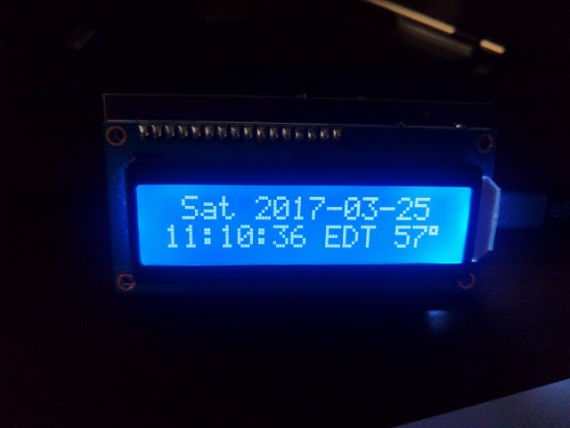
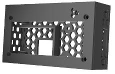

# Photon Clock

This repository contains all of the software and schematics required to build
and flash a 16x2 smart clock driven by a [Particle Photon](https://store.particle.io/#photon).

## Parts list

- PCB (see below for details)
- [HD44780 assembled LCD](https://www.adafruit.com/products/1447)
- Trim potentiometer (should come with the HD44780)
- [TMP36 temperature sensor](https://www.adafruit.com/products/165) (not needed if using external weather)
- [Particle Photon with headers](https://store.particle.io/#photon)
- ~50-60ohm THT resistor
- 10nF capacitor

### 3D printed enclosure
- Enclosure itself (see below for details)
- 4x M2x20mm machine screws
- 4x M2 nuts
- [Optional] 30mm cooling fan (requires fasteners and electrical tape)

## PCB details

Eagle 8 format schematics are included in the "eagle" directory in this
repository. If you wish to order a PCB, you will need to use a service that
supports Eagle .brd files, or generate your own Gerbers.

I recommend [OSH Park](https://www.oshpark.com/) for ease of use, cost, quality,
and their cool purple soldermask. You can order this board directly with [this](https://www.oshpark.com/orders/cart)
link.

## 3D printed enclosure details

Autodesk Fusion 360 source files and printable STL files are included in the "enclosure" directory in this repository.

### Assembly notes
* Print using 100% infill; no supports necessary.
* If using a cooling fan, cover the top of the partition that separates the Photon board from the temperature sensor with electrical tape. This will create a seal between the enclosure bottom and the PCB to block pushed air from impacting temperature readings. Fan is intended to be mounted externally using the mounting holes on the enclosure bottom.

## Building the software

### Pre-requisites

- A registered, Wi-Fi enabled Photon, ideally already connected
- The Particle IDE or command line tools installed and configured
- If you wish to use the command line version, a \*nix compatible shell is
  required

See instructions in the `code/build.sh` script to build and flash the Photon via
the command line. To flash via the Particle Atom IDE, open the project in `code`
and flash as usual.

If you wish to use the built-in temperature sensor, you will need to comment out
the following line:

`#define EXTERNAL_TEMP true`

## External integrations

In order for the clock to set the correct timezone, you will need to configure
the `timezone.json` external integration in the `integrations` directory in the
Particle console.

In order for the clock to collect external weather, you will need to configure
the `weather.json` external integration.

**Please note** that you must supply your own API key or none of the
integrations will work.

To configure each custom integration:
1. Go to [https://console.particle.io/integrations](https://console.particle.io/integrations) in your web browser
1. Click "NEW INTEGRATION"
1. Click "Webhook", then "Custom JSON"
1. Paste the contents of the relevant `.json` file from the `integrations`
   directory
1. Edit the URL section to include your API key
1. Click "CREATE WEBHOOK"

